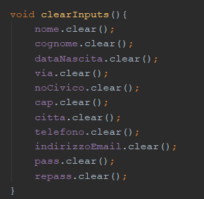

# GESTIONE CASINÒ | Diario di lavoro - 17.04.2019
##### Matan Davidi, Thor Düblin, Matteo Forni, Carlo Pezzotti, Mattia Toscanelli
### Trevano, 17 aprile 2019

## Lavori svolti
Matan è riuscito a importare correttamente il database aggiornato sul server di produzione modificando il file dump estratto dalla sua versione locale fino a farlo diventare il contenuto di [questo file](../code/sql/DB/cashyland_db_2.sql). Di seguito trovate un breve riassunto delle modifiche:
- Aggiunte tabelle ponte "media" - "game", "media" - "room" e "media" - "promotion".
- Aggiunti attributi "title" e "description" dove necessario in modo che compaiano nelle tabelle "game", "room" e "promotion".
- Aggiunta la colonna "type" di tipo VARCHAR(45) alla tabella "user". Questa colonna ha un vincolo di integrità che punta alla tabella "user_type", che contiene dei valori predefiniti.
- Cambiato il nome della tabella "type" in "media_type" per non confonderla con "user_type".
- Modificata la tabella promotion_user in modo che si possa mostrare una promozione a un certo tipo di utenti invece che a un utente singolo (questo è stato fatto modificando la colonna "user_name" in "user_type" e impostando la chiave esterna in modo che si riferisca alla colonna "type" della tabella "user").

Inoltre ha aggiunto i valori predefiniti "Maschio" e "Femmina" alla tabella "gender" e i valori "occasionale" e "settimanale" nella tabella "user_type".

Thor oggi ha completato l'installazione di selenium in modo che possano essere eseguiti i test nel server senza interfaccia grafica, installando quindi diversi pacchetti tra cui:
- xvfb,
- libxi6,
- libgconf-2-4,
- google-chrome-stable,
- chromedriver_linux64.zip,
- openjdk-8-jre-headless,
- default-jdk e infine
- selenium-server-standalone-3.13.0.jar e
- testng-6.8.7.jar.zip

Per eseguire, i test le librerie selenium-server-standalone-3.13.0.jar e testng-6.8.7.jar dovranno essere presenti nella stessa cartella dei test, e prima di compilare la classe per eseguire i java dovrà essere scritto il seguente codice da linea di comando:
```
export CLASSPATH=".:selenium-server-standalone-3.13.0.jar:testng-6.8.7.jar"
```
Per poi compilare il programma di test con javac ed eseguirlo con java.

Per completare l'installazione correttamente si sono seguite le guide già citate in precedenza:
- https://tecadmin.net/setup-selenium-chromedriver-on-ubuntu/
- https://gist.github.com/ziadoz/3e8ab7e944d02fe872c3454d17af31a5

Matteo oggi ha continuato e terminato i test con selenium. Le modifiche apportate sono che ora il test di registrazione controlla almeno tre casi errati per ogni input dopodiché, se tutti giustamente falliscono, fa una prova con dei dati validi.
Nel test di login sono è stato aggiunto il metodo che esegue il click del bottone ed in entrambe le classi sono state fatte alcune piccole modifiche dovute a dei cambiamenti della pagina html.
Il test della registrazione si presenta quindi così:


Per ogni input si esegue un test come mostrato, i metodi di test riempiono tutti gli input con valori validi tranne quello da testare così da verificare se la validazione di ogni input singolarmente funziona.

Carlo oggi ha messo a posto il test legati ai controlli del database. Durante lo stand-up abbiamo pensato che su il repository production ci deve essere solo il sito, quindi ho modificato lo script per il push sulla repo.

Mattia oggi ha messo a posto le notifiche mostrate a schermo quando l'utente inserisce i propri dati nella pagina di registrazione. La lezione scorsa non era riuscito a modificare in modo dinamico il testo delle notifiche e quest'oggi a messo a posto nel modo seguente:
```html
<input
	name="surname"
	type="text"
	class="form-control"
	id="surname" placeholder="Cognome"
	onkeydown="normal(this)"
	onfocus="tooltip(this,'  Max 50 caratteri, solo lettere e caratteri da scrittura')"
>
```

In seguito nella funzione tooltip viene mostrata la notifica all'input corrispondente nella posizione in basso a destra così:
```java
function tooltip(input, testo){
    $(input).notify(
        testo,
        {
            elementPosition:"bottom right",
            className: 'info'
        }
      );
}
```

##  Problemi riscontrati e soluzioni adottate
Matan ha avuto problemi a installare Selenium sul server, prima a causa di un problema di memoria RAM, risolto chiudendo il processo di jenkins, veniva mostrato il seguente errore:
```
dpkg: unrecoverable fatal error, aborting:
 unknown group 'smmsp' in statoverride file
E: Sub-process /usr/bin/dpkg returned an error code (2)
```
Questo problema è stato risolto rimuovendo i riferimenti al gruppo creato dall'installazione del mail server eseguita in passato. Matan ha infatti eseguito i seguenti comandi:
```
dpkg-statoverride --remove /usr/lib/sm.bin/sendmail
dpkg-statoverride --remove /usr/lib/sm.bin/mailstats
```

Matteo ha riscontrato come problema che Selenium negli input non sovrascrive ma aggiunge solo test, ha dovuto quindi creare un metodo che gli svuotasse ogni volta.



##  Punto della situazione rispetto alla pianificazione
Rispetto alla pianificazione siamo in orario.

## Programma di massima per la prossima giornata di lavoro
Riuscire a installare Selenium sul server di produzione.
